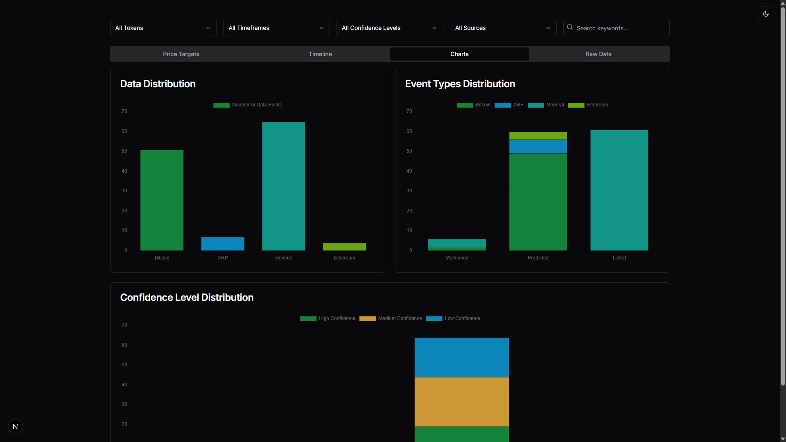

<div align="center">

# Market Oracle 🔮



**AI-Powered Crypto Market Analysis & Prediction Tool**

Market Oracle is an intelligent cryptocurrency market analysis system that combines economic calendar data, YouTube analyst transcripts, and historical event analysis to generate actionable trading insights and short-term price predictions for Bitcoin, XRP, and other major cryptocurrencies.

</div>

## 🏗️ Architecture

Market Oracle consists of two separate applications that work together:

- **`/api`** - Python Flask REST API that handles data scraping, AI analysis, and processing
- **`/app`** - Next.js frontend application that provides a user interface for interacting with the API

Both applications must be running simultaneously for the system to work.

## 🚀 Quick Start

### Prerequisites

- **Python 3.8+** (for API)
- **Node.js 18+** and **pnpm/npm** (for frontend)
- **Anthropic API key** or **OpenRouter API key** (for AI analysis)
- Internet connection (for scraping and YouTube downloads)

### 1. Start the API Server

```bash
cd api

# Create and activate virtual environment
python -m venv env
# Windows:
env\Scripts\activate
# Linux/Mac:
source env/bin/activate

# Install dependencies
pip install -r requirements.txt

# Set up environment variables
# Create a .env file in the /api directory with:
# ANTHROPIC_API_KEY=your_key_here
# or
# AI_API_TYPE=OPENROUTER
# OPENROUTER_API_KEY=your_key_here

# Run the API server
python main.py --api
```

The API will start on `http://localhost:5000`

### 2. Start the Frontend App

```bash
cd app

# Install dependencies
pnpm install
# or
npm install

# Set up environment variables
# Create a .env.local file in the /app directory with:
# NEXT_PUBLIC_API_BASE_URL=http://localhost:5000

# Run the development server
pnpm dev
# or
npm run dev
```

The frontend will start on `http://localhost:3000`

### 3. Use the Application

1. Open `http://localhost:3000` in your browser
2. Add YouTube video URLs to analyze
3. Click "Validate" to extract transcripts
4. Click "Analyze" to run AI analysis with economic calendar data
5. Click "Process" to generate CSV data
6. View the comprehensive dashboard with insights

## 📚 Documentation

For detailed documentation about each component:

- **[API Documentation](./api/readme.md)** - Complete API documentation, endpoints, configuration, and architecture
- **[Frontend Documentation](./app/README.md)** - Frontend architecture, components, workflow, and usage

## 🌟 Key Features

- **Economic Calendar Integration** - Scrapes events from ForexFactory and TradingEconomics
- **YouTube Transcript Analysis** - Extracts and analyzes crypto analyst video transcripts
- **AI-Powered Predictions** - Uses Claude AI to generate directional predictions with magnitude estimates
- **Historical Pattern Analysis** - Analyzes correlations between economic events and crypto price movements
- **Interactive Dashboard** - Visualize predictions, price targets, event timelines, and data tables
- **Polymarket Tracking** - Optional real-time tracking of Polymarket prediction markets with probability monitoring

## 📦 Modules

### Polymarket Tracking Module

The Polymarket Tracking module provides optional integration with Polymarket prediction markets. This module allows you to:

- **Track Real-Time Markets**: Monitor Polymarket events and markets in real-time
- **View Market Probabilities**: See current outcome probabilities and price movements
- **Optional API Keys**: Works without API keys for public data, with optional keys for enhanced features
- **Interactive Dashboard**: Access via the "Tracking" tab in the dashboard

**How it works:**
1. Navigate to the dashboard after processing an analysis
2. Click on the "Tracking" tab
3. Enable Polymarket tracking with the checkbox
4. Enter a Polymarket event URL or slug
5. View all markets with probabilities, buy prices, and volume data

**Configuration:**
- API keys are optional - the module works with public Polymarket data without authentication
- For enhanced features, add Polymarket API keys to your `.env` file (see [API Documentation](./api/readme.md#polymarket-api-keys) for details)
- The module will warn you if keys are not configured but allow you to continue with public data access

See the [API Documentation](./api/readme.md#polymarket-api-keys) for detailed setup instructions.

## 🔧 Configuration

### API Configuration

All API configuration is done through a `.env` file in the `/api` directory. See [API Documentation](./api/readme.md) for complete configuration options.

**Required:**
- `ANTHROPIC_API_KEY` or `OPENROUTER_API_KEY` (depending on `AI_API_TYPE`)

**Optional:**
- `FOREXFACTORY_START_DATE` - Start date for ForexFactory scraping
- `FOREXFACTORY_USE_WEEK` - Use week-based scraping (default: true)
- `TRADINGECONOMICS_START_DATE` - Start date for TradingEconomics scraping
- `TRADINGECONOMICS_END_DATE` - End date for TradingEconomics scraping
- `POLY_API_KEY` - Polymarket API key (optional, for enhanced features)
- `POLY_API_SECRET` - Polymarket API secret (optional, for enhanced features)
- `POLY_API_PASSPHRASE` - Polymarket API passphrase (optional, for enhanced features)

### Frontend Configuration

Frontend configuration is done through a `.env.local` file in the `/app` directory.

**Required:**
- `NEXT_PUBLIC_API_BASE_URL` - URL of the API server (default: `http://localhost:5000`)

## 📋 Workflow

1. **Validate** - User adds YouTube URLs → Frontend sends to API → API validates URLs and extracts transcripts → Returns `analysis_id`
2. **Analyze** - Frontend sends `analysis_id` + calendar config → API scrapes economic calendars → API runs AI analysis → Saves results
3. **Process** - Frontend sends `analysis_id` → API generates CSV data from analysis → Returns CSV + comprehensive analysis
4. **Dashboard** - Frontend displays interactive dashboard with charts, tables, and insights

## ⚠️ Important Notes

- **Both applications must be running** - The frontend requires the API to be running on the configured port
- **API keys are server-side only** - Never send API keys in request bodies; they must be configured in the API's `.env` file
- **Analysis results are stored** - Each analysis creates a timestamped directory in `api/analysis/` with all outputs
- **CORS is configured** - The API allows requests from `http://localhost:3000` and `http://127.0.0.1:3000`

## 📝 Roadmap & Wishlist

Future improvements and features we'd like to implement:

- [ ] **Telegram-based price signals** - Integrate Telegram bot to send real-time price signals and alerts based on analysis results
- [ ] **Database integration** - Migrate from file-based storage to PostgreSQL database for better data management, querying, and persistence
- [x] **Polymarket data source integration** - ✅ Integrated Polymarket as an optional tracking module for prediction market data and insights
- [ ] **Polymarket betting bot module** - Build an automated betting bot module that can place bets on Polymarket based on analysis predictions
- [ ] **Kraken realtime chart data** - Integrate Kraken (or other exchange) realtime chart data for live market analysis and visualization
- [ ] **Kraken trading bot module** - Develop an automated trading bot module that can execute trades on Kraken based on analysis signals

Have ideas? We'd love to hear them! See [Contributing](#-contributing) below.

## 🤝 Contributing

We welcome contributions! See:
- [Contributing Guidelines](./api/contributing.md)
- [Code of Conduct](./api/code-of-conduct.md)

## ⚠️ Disclaimer

This tool is for informational and research purposes only. The predictions and analysis generated by Market Oracle are based on historical patterns and AI analysis, not financial advice. Always do your own research and consult with financial professionals before making trading decisions. Cryptocurrency trading involves substantial risk of loss.

---

**Built with ❤️ for the crypto trading community**

